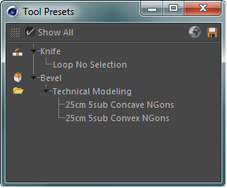

# c4d-toolpresets

ToolPresets allows you to save persets for parameters of most modeling tools. 

## Install Instructions

Download this repository and place the contents inside your Cinema 4D
plugins folder.
